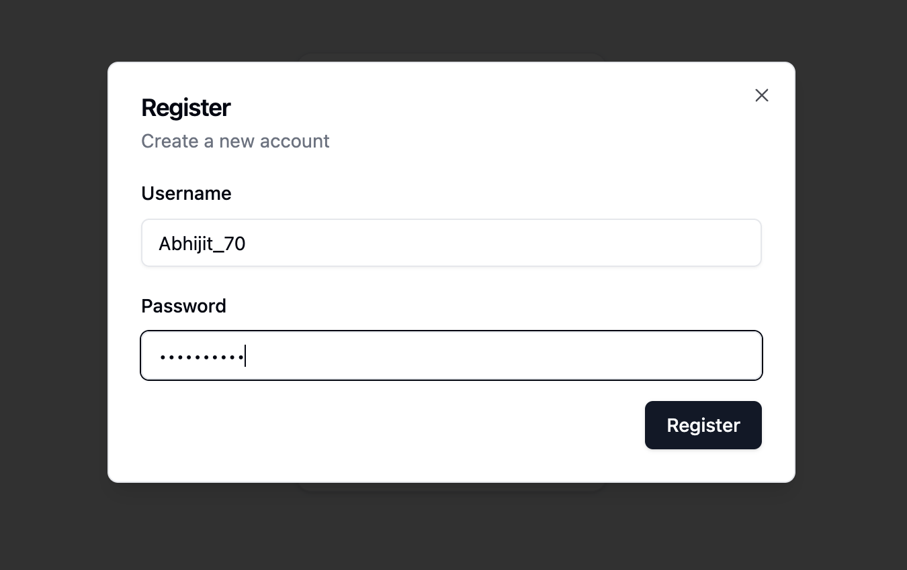

# Wallet App

## Overview

Wallet App is a simple, user-friendly digital wallet application built with React and TypeScript. It provides basic functionalities for managing a digital wallet, including user registration, login, balance checking, deposits, and withdrawals.

## Features

- User Registration
- Secure Login
- Balance Checking
- Deposit Funds
- Withdraw Funds

## Practical Use Cases

1. **Personal Finance Management**: Users can keep track of their digital funds, making it easier to manage personal finances.

2. **Prototype for Fintech Applications**: Developers can use this as a starting point or prototype for more complex fintech applications.

## Screenshots

### Login Dialog

### Register Dialog

### Deposit Flow

### Withdraw Flow

## Technology Stack

- React
- TypeScript
- Shadcn UI Components
- In-memory data storage (simulated database)

## Future Enhancements

- Implement backend API for real data persistence
- Add transaction history feature
- Implement multi-currency support
- Add user profile management
- Enhance security features (e.g., two-factor authentication)